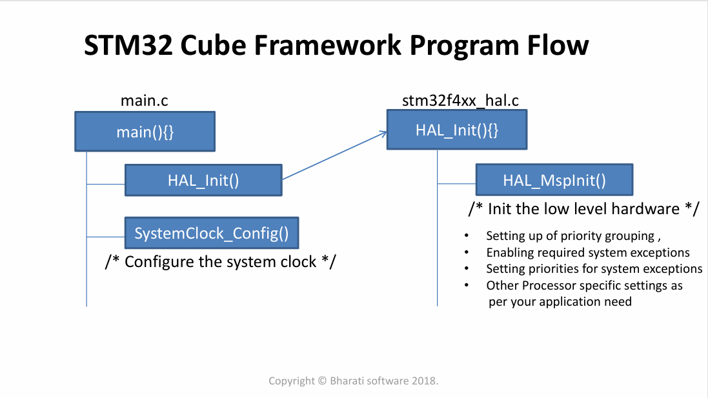
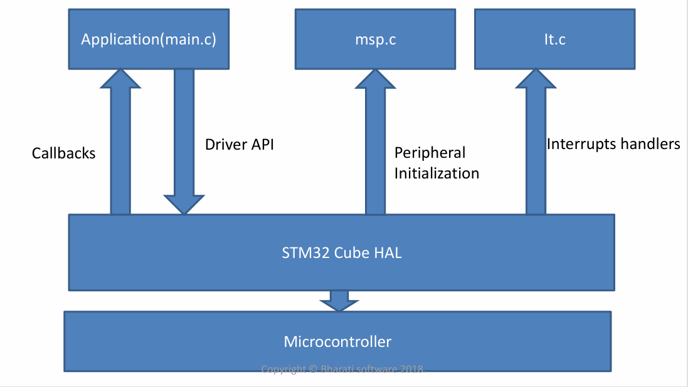

# STM32 using HAL library

## I. Reference
- document :
- video    : [youtube](https://www.youtube.com/playlist?list=PL831drV1RoWstmeXq-aUH0VB2tyhdC5dT) 
- IDE      : STM32CubeIDE | Keilc v5 & STM32CubeMx  
- Board    : STM32F407 Discovery | NUCLEO-F446RE
## II. Kiến trúc thư viên HAL

## III. Mục lục  
1. [UART]()
2. [Timer]()
3. [PWM]()
4. [CAN]()
5. [Low Power Mode]()
6. [RTC]()