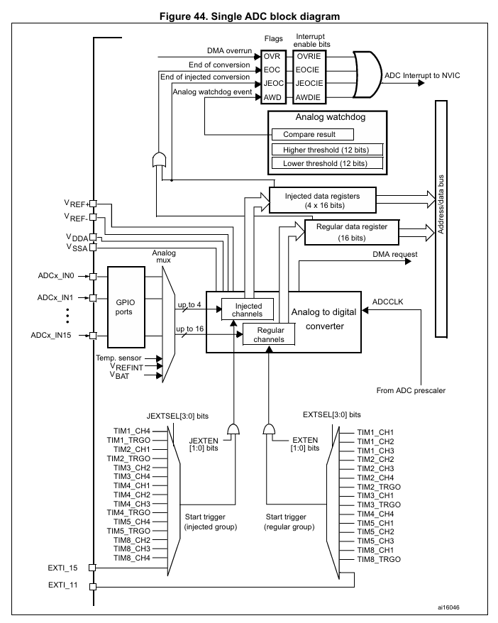
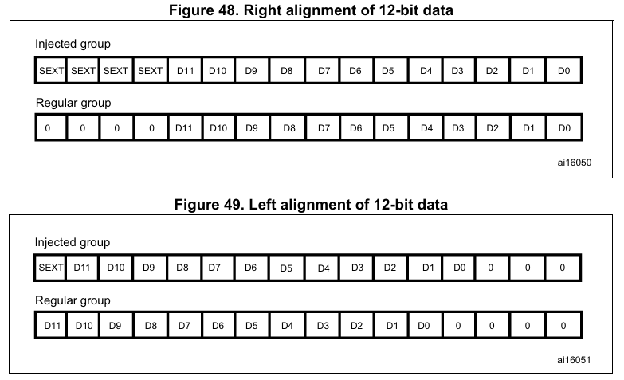
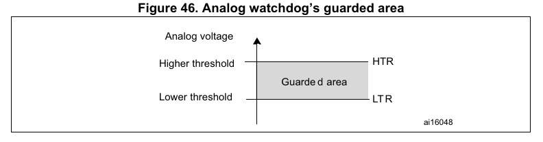
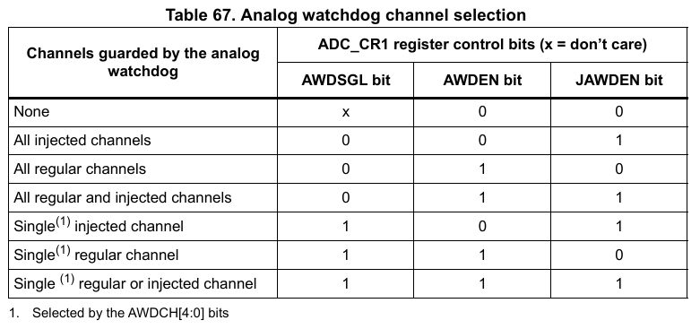
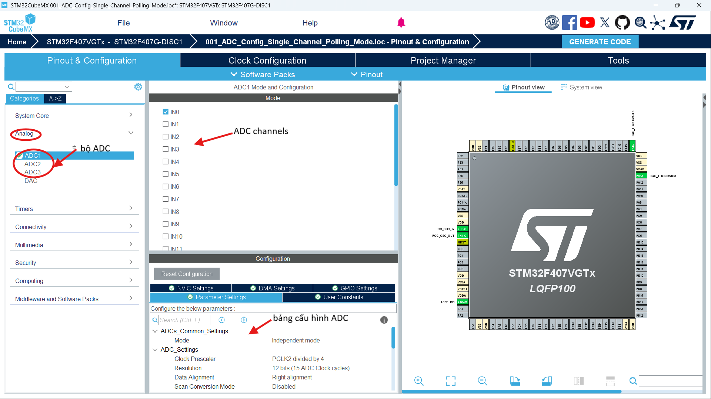
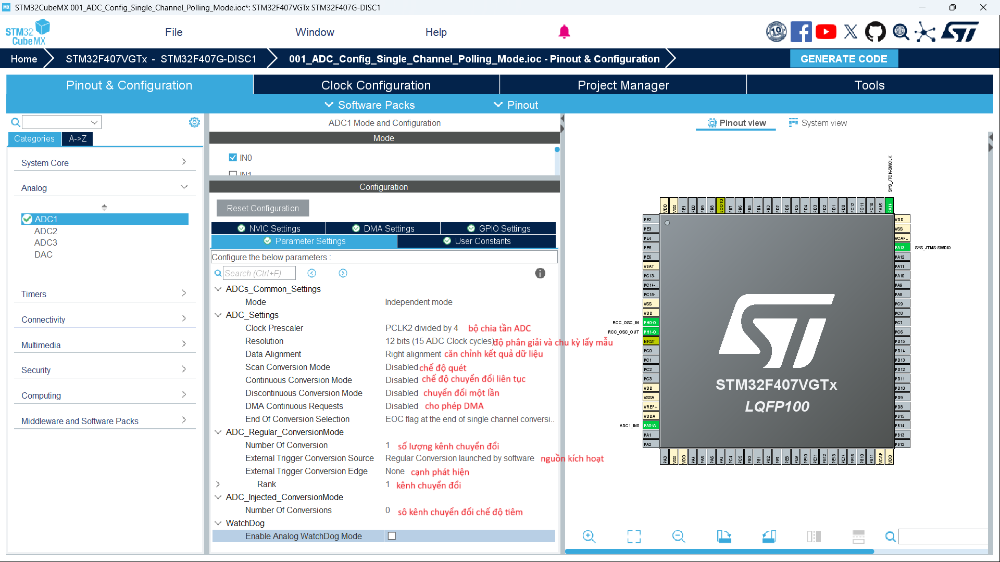
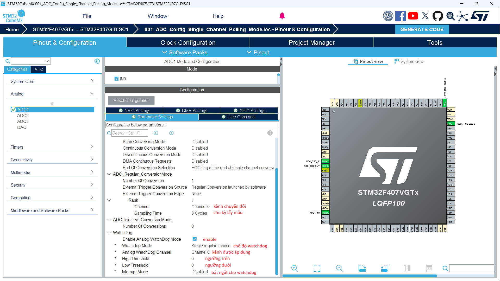
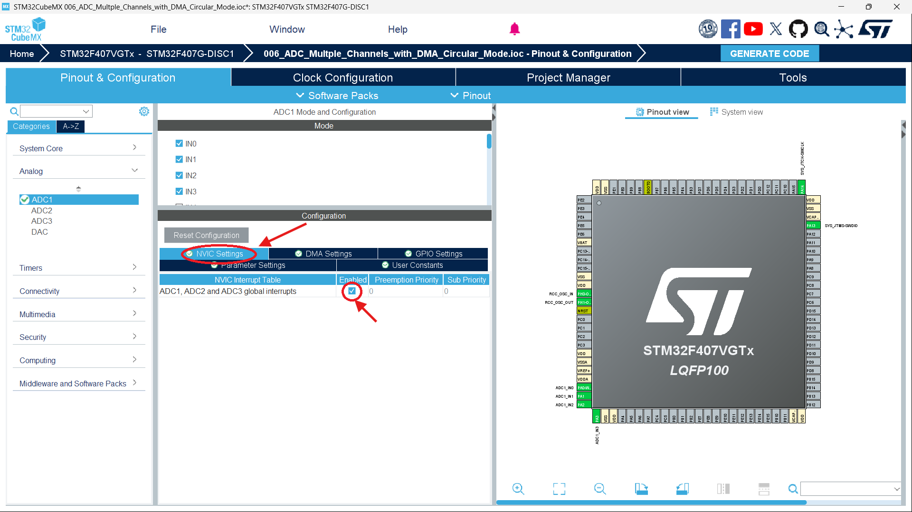
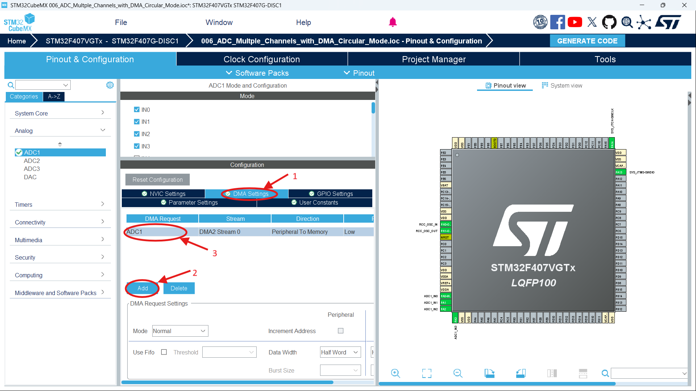

# ADC 
## I. Giới thiệu chung
### 1. Khái niệm chung 
- ADC hay Analog Digital Convertion: Bộ chuyển đổi từ tín hiệu tương tự sang tín hiệu số 
### 2. Trong STM32F407VGTx 
- Có 3 bộ ADC thuộc sự quản lý của APB2 bus. Mỗi bộ hỗ trợ đến 19 kênh.
- Độ phân giải có thể cấu hình 12/10/8/6 bits.
- Ngắt được tạo ra khi kết thúc quá trình chuyển đổi, trong quá trình watchdog hoặc là tràn.
- Hỗ trợ chuyển đổi đơn/liên tục, chế độ quét cho quá trình chuyển đổi. 
- ADC có thể được kích hoạt cho cả quá trình chuyền đổi bình thường(regular conversions) và quá trình chuyền đổi tiêm(injected conversions).
<!-- -  -->
## II. Tham số cơ bản của ADC trong STM32F40xx
### 1. ADC block diagram

### 2. ADC on/off control
### 3. ADC Clock
ADC có hai sơ đồ đồng hồ:
- Đồng hồ cho mạch tương tự: ADCCLK. Được dùng để hỗ trợ hoạt động lấy mấu và chuyển đổi ADC. Nó cho phép hoạt động ở fPCLK2/2, /4, /6 hoặc /8 bằng cách chọn giá trị ADCPRE[0:2] trong ADC_CCR
- Đồng hồ cho giao diện kỹ thuật số (được sử dụng để truy cập đọc/ghi thanh ghi). được bật/tắt riêng cho từng ADC thông qua thanh ghi RCC_APB2ENR
### 4. ADC Channels selection
- ADC hỗ trợ 16 kênh: ADC_IN[0:15] + 1 kênh đọc nhiệt độ. Cho phép sắp xếp trình tự chuyển đổi
- có thể chuyển đổi thành 2 nhóm:
  - regular group(16 kênh): Tổng số kênh chuyển đổi được ghi vào L[3:0] trong ADC_SQR1. Các trình tự chuyển đổi các kênh được xắp xếp vào ADC_SQRx. 
  - injected group(4 kênh): Tổng số kênh chuyển đổi được ghi vào L[3:0] trong ADC_JSQR. Các trình tự chuyển đổi các kênh được xắp xếp vào ADC_JSQR.


Single conversion mode
 Continuous conversion mode
### Calculate ADC Conversion Time
- chọn chu kỳ lấy mẫu(sampling_cycles) của từng kênh bằng cách lựa chọn giá trị từ bit SMPx[0:1] trong thanh ghi ADC_SMPR1/2
- chu kỳ chuyển đổi(conversion_cycles) trong STM32F407VGTx là 12 cycles
- Công thức tính toán thời gian chuyển đổi quá trình ADC
$Tcvt$ = (sampling_cycles + conversion_cycles)/ (APB2_clock / ADC_prescales) 

### Data alignment
- bằng cách set ALIGN bit trong thanh ghi ADC_CR2 sẽ căn chỉnh dữ liệu trong thanh ghi ADC_VAL
- 12 bits

- 6 bits

### WatchDog 
- WatchDog trong ADC có nghĩa là giám sát
- Giá trị ngưỡng sẽ được lưu vào trong 12bits LSB của thanh ghi ADC_HTR và 16 bits LSB của thanh ghi ADC_LTR
- Ngắt có thể được kích hoạt bởi AWDIE bit của thanh ghi ADC_CR1
- Nếu giá trị chuyển đổi ADC ko nằm trong khu vực ngưỡng trên và ngưỡng dưới sẽ sảy ra ngắt

- chọn kênh giám sát


Scan mode
Injected channel management

## III. Cấu hình ADC cấp độ thanh ghi 

## IV. Cấu hình STM32CUBE Mx
### 1. Cấu hình cơ bản



### 2. Cấu hình ngắt

### 3. Cấu hình DMA

## V. API
### 1. ADC base
``` C
/**
 * @brief: bắt đầu quá trình chuyển đổi ADC
*/
HAL_StatusTypeDef HAL_ADC_Start(ADC_HandleTypeDef *hadc);

/**
 * @brief: đọc giá trị ADC
 * @reval: giá trị ADC đã được chuyển đổi
*/
uint32_t HAL_ADC_GetValue(ADC_HandleTypeDef *hadc)

/**
 * @brief: Kết thúc quá trình chuyển đổi ADC 
*/
HAL_StatusTypeDef HAL_ADC_Stop(ADC_HandleTypeDef *hadc)
```
### 2. ADC Interrupt
``` C
/**
 * @brief: Bắt đầu quá trình chuyển đổi ADC Interrupt
*/
HAL_StatusTypeDef HAL_ADC_Start_IT(ADC_HandleTypeDef *hadc);
/**
 * @brief: Kết thúc quá trình chuyển đổi ADC Interrupt
*/
HAL_StatusTypeDef HAL_ADC_Stop_IT(ADC_HandleTypeDef *hadc);

/**
 * @brief: Hàm Callback được gọi khi kết thúc quá trình chuyển đổi ADC
*/
void HAL_ADC_ConvCpltCallback(ADC_HandleTypeDef *hadc)
{
    /* Code here */
    ADC_val = HAL_ADC_GetValue(hadc);
}
```
### 3. ADC DMA
``` C
/**
 * @brief: bắt đầu quá trình chuyển đổi ADC với DMA
 * @param[pData]: con trỏ chứa dữ liệu ADC đã được chuyển đổi từ các kênh
 * @param[Length]: số lượng kênh chuyển đổi  
*/
HAL_StatusTypeDef HAL_ADC_Start_DMA(ADC_HandleTypeDef *hadc, uint32_t *pData, uint32_t Length);
/**
 * @brief: Kết thúc quá trình chuyển đổi ADC với DMA
*/
HAL_StatusTypeDef HAL_ADC_Stop_DMA(ADC_HandleTypeDef *hadc);
```
