# Low Power Mode
## I.Giới thiệu chung
### 1. Khái quát về chế độ tiết kiệm năng lượng(Low Power Mode)
- Một số tính năng tiết kiệm điện năng có sẵn trong bộ xử lý Cortex-Mx.
Ngoài ra, các nhà cung cấp vi điều khiển thường cũng triển khai
một số chế độ tiết kiệm điện năng trong các vi điều khiển dựa trên Cortex-Mx của họ. -> các chế độ hoặc tính năng tiết kiệm điện năng 
- Tại MCU có 2 mode chính \
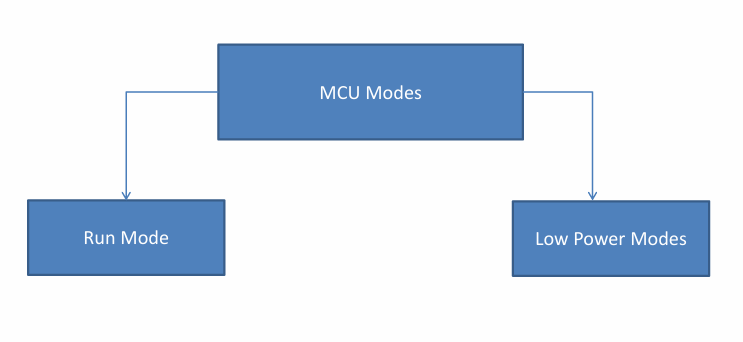 
    - Run Mode: Processor sẽ luôn luôn tạo clock, thực hiện hoạt động bình thường và luôn tiêu thụ năng lượng 
    - Low Power Modes: khi bộ xử lý không có việc gì, ta có thể chuyển sang chế độ năng lượng thấp, Nếu không MCU sẽ luôn ở chế độ tiêu thụ năng lượng, Dối với các ứng dụng sử dụng pin thì nên sử dụng LPM 
### 2. Processor Specific Low Power modes
- Đối với chế độ tiết kiệm năng lượng có 2 chế độ Normal sleep và Deep sleep \
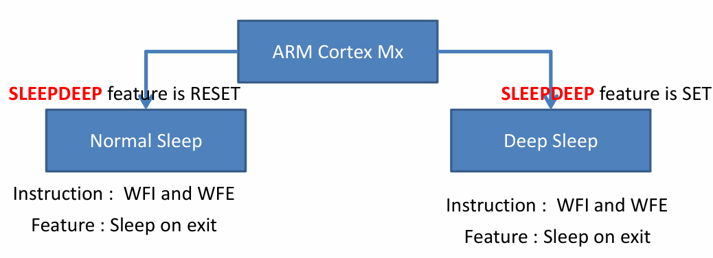
1. Normal Sleep Vs Deep Sleep
    - Normal sleep mode sẽ dừng processor clock \
    - Deep sleep mode dừng system clock và tắt PLL và flash memory
2. Enter Normal Sleep
    - SLEEPDEEP bit phải được reset \
    - có thể sử dụng WFI và WFE kích hoạt sleep mode hoặc cũng có thể set SLEEPONEXIT bit SCB của ARM
3. Enter Deep Sleep
    - SLEEPDEEP bit phải được set \
    - có thể sử dụng WFI và WFE kích hoạt sleep mode hoặc cũng có thể set SLEEPONEXIT bit SCR của ARM 
### 3. Entering SLEEP mode 
1. Entering SLEEP mode using Sleep-on-Exit feature
- Nếu sử dụng SLEEPONEXIT MCU sẽ truy cập vào sleep mode một cách tự động sau khi thoát quá trình sử lý ngắt (ISR)
``` C
SLEEPONEXIT();
``` 
- ``note`` : những đặc điểm của tính năng Sleep-on-Exit: \
    - SLEEPONNEXIT không phải là lệnh \
    - SLEEPONEXIT không thể khiến processor truy cập vào sleep mode nếu ngắt này trả về một ngắt khác (nested interrupt) \
    - trong các ứng dụng điều khiển ngắt, không nên bất tính năng SLEEPONEXIT quá sớm. Vì nếu trong qúá trình khởi tạo nếu nhận được yêu cầu ngắt nó sẽ chuyển sang chế đọ ngắt rồi sleep các quá trình khởi tạo sau sẽ ko dc hoàn tất 

2. Entering SLEEP mode using WFI
- WFI là một lệnh trong Cortex-Mx
- Khi sử dụng lệnh WFI MCU truy cập vào chế độ SLEEP ngay lập tức
``` C
__WFI();
asm volatile ("wfi");
``` 

3. Entering SLEEP mode using WFE
- là một lệnh thumb 16bit
- thường được sử dụng dự kiến của nó là một phần của chiến lược tiết kiệm năng nượng trong RTOS 
- Thực thi WFE không khiến MCU truy cập vào SLEEP mode ngay lập tức. 
- Sự thành công của WFE phụ thuộc vào Event register bit. WFE đưa bộ xử lý vào chế độ ngủ chỉ khi bit thanh ghi sự kiện là 0 tại thời điểm thực hiện lệnh WFE
- khi thực thi WFE nếu Event register bit = 1, nó sẽ đặt nó về 0 MCU ko trở về trạng thái ngủ
``` C
__WFE();
asm volatile ("wfe");
```
`` note``
- Phần mềm không thể truy cập vào Event register bit
- event register có thể được set theo những sự kiện sau
    - Exception entrance and exception exit 
    - yêu cầu ngắt
    - Các ngắt đang chờ xử lý mới (chỉ khi bit SEVONPEND trong SCR được đặt),ngay cả khi các ngắt bị vô hiệu hóa 
    - Tín hiệu sự kiện bên ngoài từ phần cứng trên chip (cụ thể là MCU)
    - Thực hiện lệnh SEV (Gửi sự kiện)
    - Debug event
- Khi nhiều sự kiện xảy ra trong khi bộ xử lý đang hoạt động, chúng sẽ được coi như chỉ là một sự kiện vì thanh ghi sự kiện chỉ có một bit.
### 4. Waking up from SLEEP mode
1. Waking up from SLEEPONEXIT
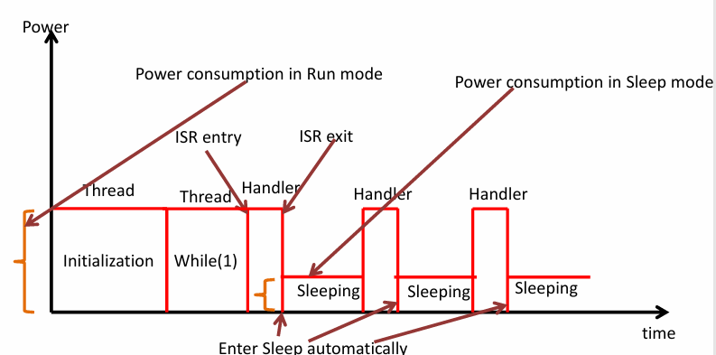 
- bộ xử lý dừng thực thi lệnh, vào chế độ ngủ và thức dậy khi
yêu cầu ngắt có mức ưu tiên cao hơn đến và cần được phục vụ.
- trong trường hợp ST, bộ xử lý thức dậy cho bất kỳ ngắt nào, tức là mức ưu tiên không quan tâm
2. Waking up from WFI
- Khi bộ xử lý chuyển sang chế độ ngủ khi thực thi lệnh WFI ở thread mode, bất kỳ yêu cầu ngắt, yêu cầu gỡ lỗi hoặc đặt lại nào cũng có thể đánh thức bộ xử lý.
- Khi bộ xử lý chuyển sang chế độ ngủ khi thực thi lệnh WFI ở handler mode.
- MCU sẽ được đánh thức khi có yêu cầu của ngắt có mức ưu tiên cao hơn ngắt ở thời điểm hiện tại. Nếu ngắt có mức ưu tiên thấp hơn hoặc bằng thời điểm hiện tại processor không thể bị đánh thức, ngắt được đặt ở trạng thái chờ
- MCU có thể đánh thức bởi yêu cầu debug và reset
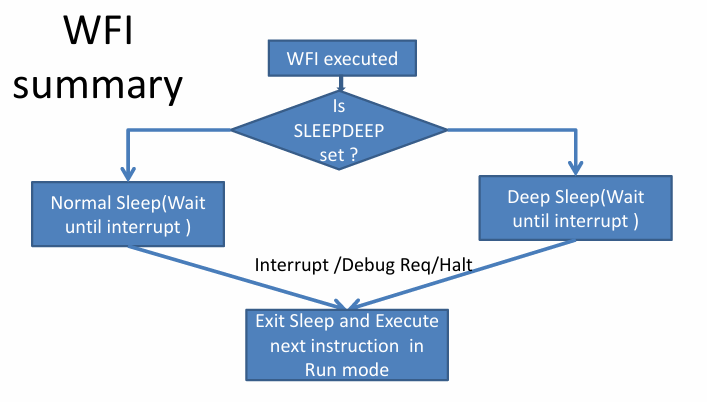 \
``Note``: Đối với STM bất cứ ngắt nào cũng có thể đánh thức Processor khỏi trạng thái nghỉ (không phụ thuộc vào mức độ ưu tiên)
3. Waking up from WFE
- khi WFE vào chế độ ngủ nó có thể đánh thức bởi:
    - Thực hiện lệnh SEV (Gửi sự kiện)
    - Bất kỳ ngoại lệ/ ngăt nào vào trạng thái Đang chờ xử lý nếu SEVONPEND trong System Control Register được đặt
    - Một ngoại lệ không đồng bộ ở mức độ ưu tiên sẽ ngăn chặn bất kỳ ngoại lệ nào đang hoạt động
    - Một sự kiện từ bộ xử lý/thiết bị ngoại vi khác


### 6. Voltage Domains
1. Voltage Domains
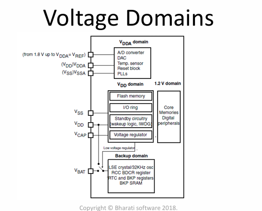
Miền 1.8V cấp cho: Core, Memory, Digital Peripheral
Miền Vdd cấp cho: Những ngoại vi và chức năng còn lại
2. Regulator
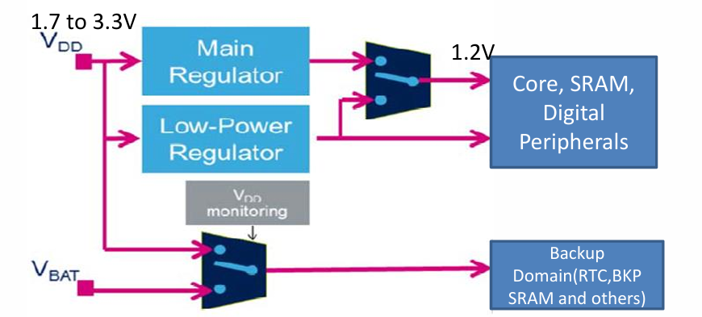
3. Regulator Modes
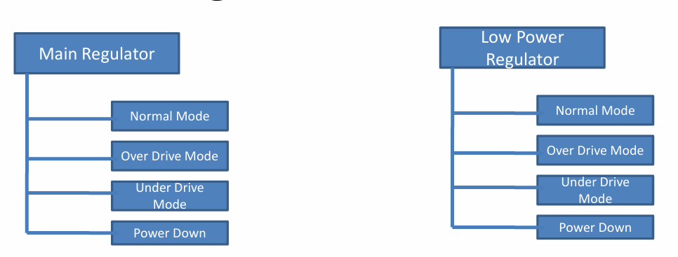
- Normal Mode: CPU và logic lõi hoạt động ở tần số tối đa tại một tỷ lệ điện áp nhất định (tỷ lệ 1, tỷ lệ 2 hoặc tỷ lệ 3). Tỷ lệ điện áp có thể được cấu hình bằng bit VOS trong PWR_CR. Sử dụng "Normal Mode" trong Run mode hoặc trong Stop mode
- Over-Drive Mode: được sử dụng để chạy CPU và Lõi logic ở tần số tối đa có thể.Điện áp đầu ra của Bộ điều chỉnh chính sẽ lớn hơn 1,2V thông thường do đó tiêu thụ nhiều điện năng hơn cho ứng dụng
- Under-Drive Mode : được sử dụng ở Stop mode. Nếu chế độ Under-drive được bật, chế độ này sẽ tự động bị vô hiệu hóa sau:
    - thoát khỏi chế độ Stop.
    - Khi bộ điều chỉnh điện áp hoạt động ở chế độ Under-drive
    - độ trễ khởi động được tạo ra khi đánh thức từ chế độ Stop 
- Power Down Mode: được sử dụng ở Standby mode. Power Down Mode chỉ được kích hoạt khi vào Standby mode. Đầu ra của bộ điều chỉnh ở trở kháng cao gây ra mức tiêu thụ bằng không. Nội dung của các thanh ghi và SRAM bị mất
### 5. Device Specific (MCU) Low Power 
1. Device Specific (MCU) Low Power Modes
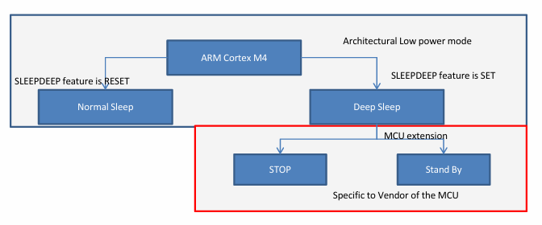
- Power Consumption
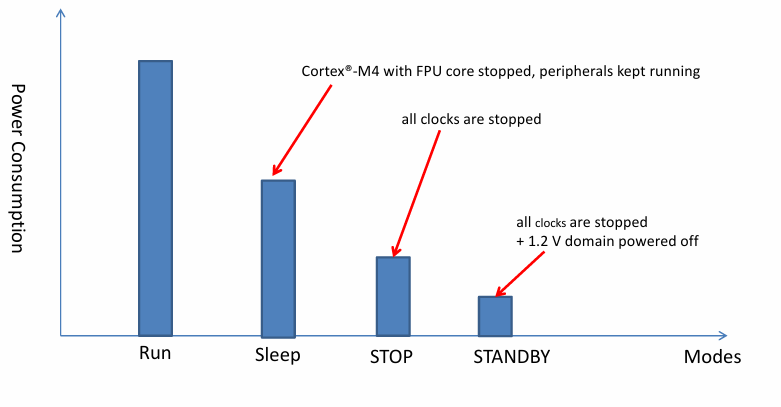
- Sleep mode
- Stop mode
- Standby mode
2. Stop mode
- Enter stop mode \
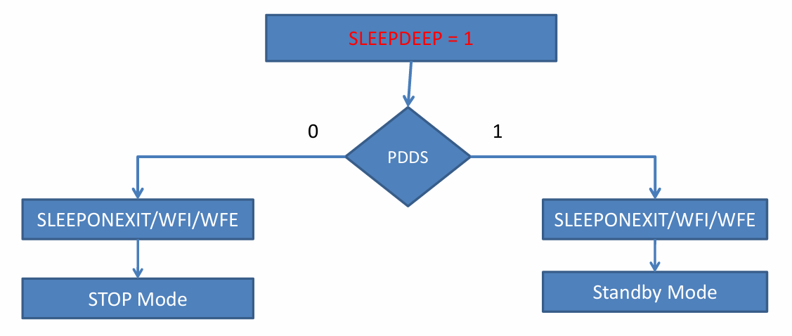 
<!--  -->
`` note `` \
    - khi tiến vào trạng thái Stop mode miền điện áp không được tắt (Normal mode/ Under-Drive mode)
- Wakeup from Stop mode
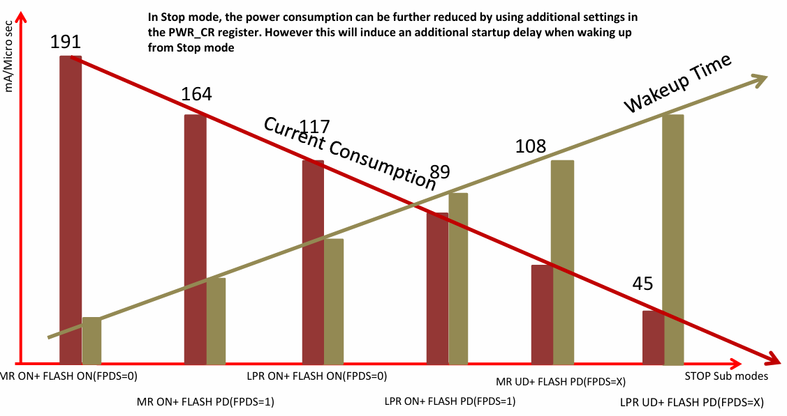
3. Standby mode
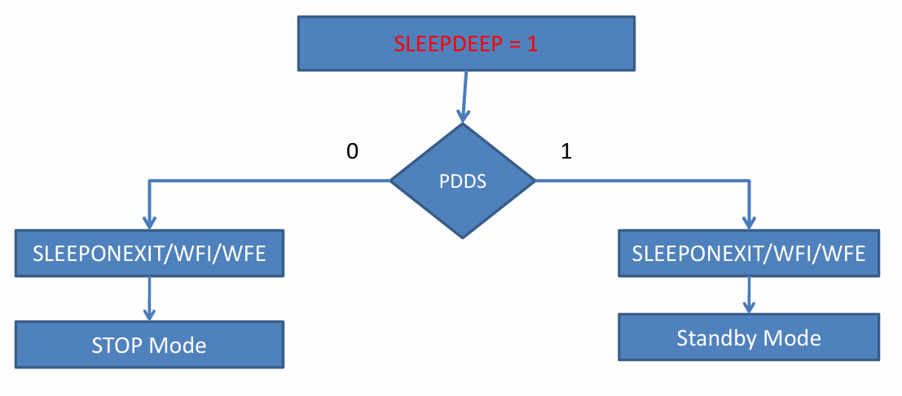
## Cấu hình 