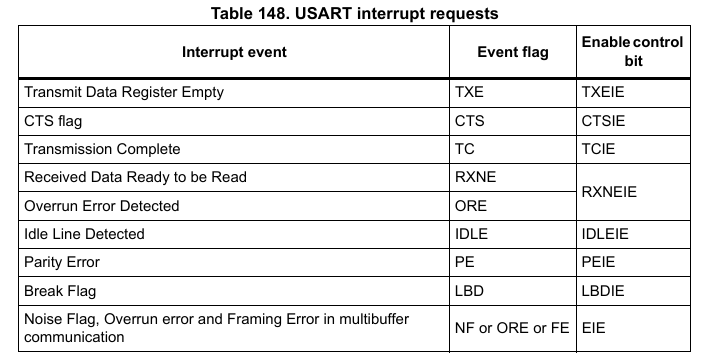

# UART/USART

## I. Giới thiệu chung
UART và USART là hai giao thức truyền thông nối tiếp được sử dụng trong các hệ thống điện tử để kết nối và trao đổi dữ liệu giữa các thiết bị.
- UART (Universal Asynchronous Receiver-Transmitter): 
  - Là giao thức truyền thông nối tiếp không đồng bộ, nghĩa là không sử dụng tín hiệu đồng hồ (clock) chung giữa hai thiết bị để đồng bộ hóa dữ liệu.
  - Dữ liệu được truyền dưới dạng các khung (frame), bao gồm bit bắt đầu (start bit), bit dữ liệu (thường 5-8 bit), bit kiểm tra lỗi (parity bit, nếu có), và bit kết thúc (stop bit).
  - Chỉ hỗ trợ truyền full-duplex (truyền và nhận đồng thời) nếu có hai đường truyền riêng biệt.
  - ứng dụng: Giao tiếp giữa vi điều khiển và module như GPS, Bluetooth.
- USART (Universal Synchronous Asynchronous Receiver-Transmitter):
  - Là phiên bản mở rộng của UART, hỗ trợ cả truyền thông đồng bộ (có tín hiệu đồng hồ) và không đồng bộ.
  - Trong chế độ đồng bộ, nó sử dụng tín hiệu đồng hồ để đồng bộ hóa việc truyền dữ liệu, giúp tốc độ truyền nhanh hơn và đáng tin cậy hơn.
  - Trong chế độ không đồng bộ, hoạt động tương tự UART.
  - Linh hoạt hơn UART, nhưng phức tạp hơn và ít phổ biến trong các ứng dụng đơn giản.
  - ứng dụng: Giao tiếp với các thiết bị cần tốc độ cao hoặc đồng bộ, như một số cảm biến hoặc bộ nhớ.
## II. Tham số cơ bản của USART trong STM32F40xx
### 1. block diagram

### 2. Cấu trúc khung dữ liệu 
- độ dài dữ liệu trong một khung truyền có thể được cấu hình 8/9 bits(bao gồm 1 party bits) bằng cách thay đổi M bit trong USART_CR1

- Ký tự nhàn rỗi(Idle character) được diễn giải là toàn bộ khung '1' theo sau là bit bắt đầu của khung tiếp theo chứa dữ liệu (Số '1' bao gồm số bit dừng).
- Ký tự ngắt(Break character) được diễn giải khi nhận được '0' trong một khoảng thời gian khung. Vào cuối khung ngắt, bộ truyền chèn 1 hoặc 2 bit dừng (bit logic '1') để xác nhận bit bắt đầu.
- Truyền và nhận được điều khiển bởi một máy phát tốc độ truyền chung, xung nhịp cho mỗi máy được tạo ra khi bit cho phép được thiết lập tương ứng cho máy phát và máy thu
### 4. Fractional baud rate generation
#### Tốc độ truyền cho USART chuẩn
Tx/Rx baud = F$_c$$_k$/(8x(2 - OVER8) x USARTDIV)
#### Tốc độ truyền cho USART chuẩn
Tx/Rx baud = F$_c$$_k$/(16 x USARTDIV)
#### Tham số
USARTDIV là số dấu phẩy cố định không dấu được mã hóa trên thanh ghi USART_BRR.
- Khi OVER8=0, phần phân số được mã hóa trên 4 bit và được lập trình bởi các bit DIV_fraction[3:0] trong thanh ghi USART_BRR
- Khi OVER8=1, phần phân số được mã hóa trên 3 bit và được lập trình bởi các bit DIV_fraction[2:0] trong thanh ghi USART_BRR và bit DIV_fraction[3] phải được giữ xóa
### 7. Party control
Kiểm soát chẵn lẻ có thể được kích hoạt bằng cách đặt bit PCE trong thanh ghi USART_CR1. Tùy thuộc vào độ dài khung được xác định bởi bit M.

#### Even parity
- Nếu tổng số bit 1 trong khung dữ liệu là lẻ thì PB = 1 
#### Odd parity
- Nếu tổng số bit 1 trong khung dữ liệu là chẵn thì PB = 1

### 9. USART synchronous mode
- USART cho phép người dùng điều khiển truyền thông nối tiếp đồng bộ hai chiều ở chế độ chính. 
- Chế độ đồng bộ được chọn bằng cách ghi bit CLKEN vào thanh ghi USART_CR2 
- Ở chế độ đồng bộ, các bit sau phải được giữ ở trạng thái xóa:
  - Bit LINEN trong thanh ghi USART_CR2,
  - Bit SCEN, HDSEL và IREN trong thanh ghi USART_CR3.
- Chân CK là đầu ra của xung nhịp máy phát USART. bit LBCL trong thanh ghi USART_CR2 cấu hình xung nhịp của dữ liệu cuối cùng có được tạo ra hay không.

- Bit CPOL trong thanh ghi USART_CR2 cho phép người dùng chọn cực tính xung nhịp 
- Bit CPHA trong thanh ghi USART_CR2 cho phép người dùng chọn pha của xung nhịp bên ngoài 

### 14. Hardware flow control

- Có thể kiểm soát luồng dữ liệu nối tiếp giữa 2 thiết bị bằng cách sử dụng đầu vào CTS và đầu ra RTS.
- Kiểm soát luồng RTS và CTS có thể được kích hoạt độc lập bằng cách ghi lần lượt các bit RTSE và CTSE thành 1 (trong thanh ghi USART_CR3).
#### RTS flow control
- RTS(request to send) là tín hiệu giúp điều khiển dòng dữ liệu truyền đi giữa hai thiết bị. 
- Khi RTS được kích hoạt thấp. Nó thông báo cho thiết bị phía bên kia rằng thiết bị này đã sẵn sàng để nhận dữ liệu.  
- RTS không được kích hoạt nó yêu cầu thiết bị truyền không gửi thêm dữ liệu nữa cho đến khi nó thông báo lại là có thể nhận.

#### CTS flow control
- CTS (Clear To Send)
- Khi CTS ở mức thấp, Nó thông báo thiết bị đối diện cho phép truyền dữ liệu.
- Khi CTS ở mức cao, STM32 ngừng truyền dữ liệu đến thiết bị đối diện, vì nó không sẵn sàng nhận thêm.

### 12. Interrupt

### 13. DMA

## III. Cấu hình USART cấp độ thanh ghi 

## IV. Cấu hình STM32CUBE Mx

## V. API
### 1. USART Base
### 2. USART Interrupt
### 2. USART DMA

