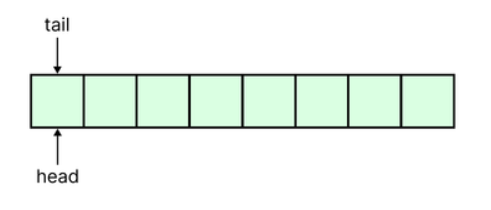
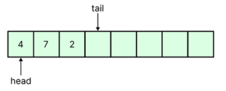
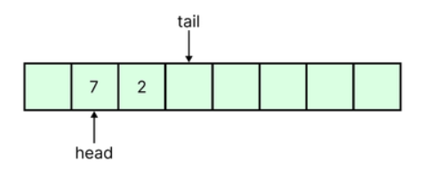
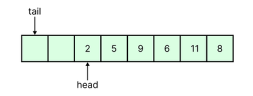

# Ring Buffer
## I. Khái niệm
Ring Buffer (RB) là cấu trúc buffer sử dụng rất phổ biến trong lập trình nhúng vi điều khiển, ví dụ: Serial trong arduino sử dụng Ring Buffer, các cấu trúc lọc nhiễu với dữ liệu đầu vào là N phần tử mới nhất,...  Nắm vững cấu trúc này giúp các cấu trúc code của các bạn sẽ rất linh hoạt.

## II. Cấu trúc của Ring Buffer
- Ring Buffer được gọi là Circular buffer (bộ đệm vòng), hoạt động theo nguyên tắc FIFO (First In, First Out). Điểm khác biệt với FIFO là khi đầy dữ liệu RB sẽ ghi đè lên dữ liệu cũ nhất (Circular). 
- Có 2 cách hiện thực RB:
  - RB hiện thực trên một mảng (Array).
  - RB hiện thực trên một danh sách liên kết (Linklist).

## III. Cơ chế hoạt động của Ring Buffer trên mảng(Array)
- Ring Buffer được khởi tạo với là một mảng với kích thước cố định, head và tail đều bằng vị trí đầu tiên của mảng.

- Sau khi put một phần tử, tail sẽ dịch sang chỉ mục (index) kế tiếp để chuẩn bị cho lần put kế tiếp.

- Khi get một phần tử, head dịch sang mục(index) kế tiếp cho lần get tiếp theo.

- Khi đầy mảng, dữ liệu mới sẽ ghi đè lên dữ liệu cũ nhất.

## IV. Cách sử dụng Ring Buffer
Ring Buffer được sử dụng trong nhiều trường hợp như:
- Làm bộ đệm chờ xử lý: Khi viết chương trình truyền nhận dữ liệu giữa vi điều khiển và PC: 
  - khi nhận được 1 byte dữ liệu từ PC, trong Interrupt UART sẽ put byte nhận vào Ring Buffer, trong main() while loop sẽ kiểm tra kích thước RB và lấy dữ liệu ra xử lý. 
  - RB luôn đảm bảo Buffer không bị tràn nếu PC gửi liên tục, trường hợp xấu nhất không get kịp dữ liệu thì luôn có N dữ liệu mới nhất đang nằm trong buffer để xử lý.
- Các tính năng lọc nhiễu: 
  - phương pháp sử dụng 10 phần tử mới nhất để tính trung bình, dữ liệu sẽ đẩy định kì vào RB.
  - khi nào cần tính toán, bạn chỉ cần lấy toàn bộ dữ liệu của RB ra tính trung bình là xong.
