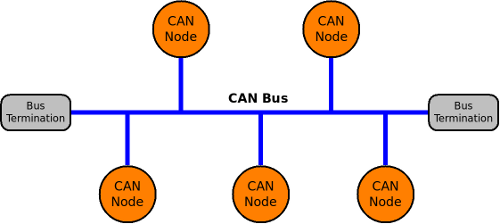
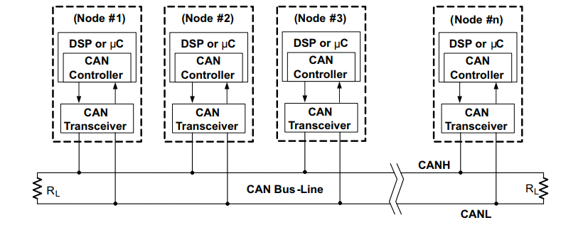
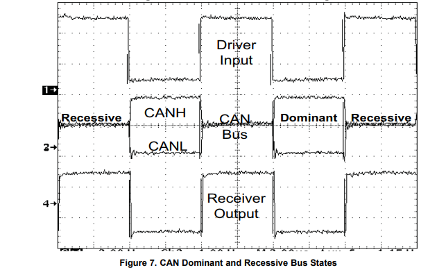
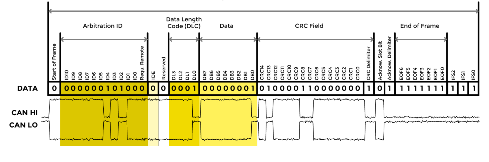
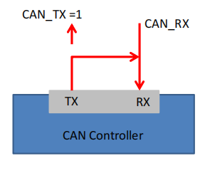
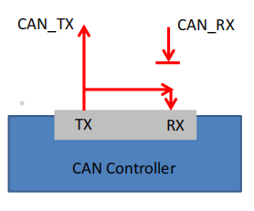
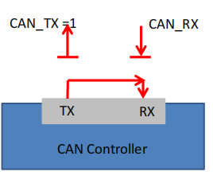
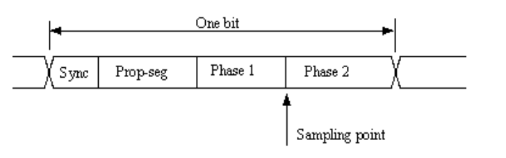

# Controller Area Network (CAN)
## I. Giới thiệu chung 
### 1. Giới thiệu về CAN bus
- Giao thức Can ban đầu được phát triển vào cuối những năm 1980 bởi công ty Đức
Robert Bosch cho ngành công nghiệp ô tô
- Đây là một bus truyền thông nối tiếp đa chủ có thông số kỹ thuật thiết kế cơ bản yêu cầu tốc độ cao, khả năng chống nhiễu cao và các tính năng phát hiện lỗi
- CAN cung cấp khả năng truyền dữ liệu lên đến 1 Mbit/giây
- Các tính năng hạn chế lỗi và phát hiện lỗi làm cho nó đáng tin cậy hơn trong các môi trường quan trọng về tiếng ồn. Trong ngành công nghiệp ô tô
### 2. Tính năng đặc biệt về của CAN
- Chi phí thấp
- Độ bền cực cao
- Tốc độ truyền dữ liệu cao (lên đến 1 MBit/giây).
- Độ tin cậy. Khả năng xử lý lỗi và hạn chế lỗi tuyệt vời.
- Tự động truyền lại các thông báo lỗi.
- Tự động ngắt kết nối bus của các nút bị nghi ngờ là có lỗi vật lý.
- Định địa chỉ chức năng – các thông báo dữ liệu không chứa địa chỉ nguồn hoặc đích, chỉ có các mã định danh liên quan đến chức năng và/hoặc mức độ ưu tiên của chúng. 
## II. Cấu trúc bus
### 1. broadcast type of Bus
1. Cấu trúc Can bus
 \
- Tất cả các thiết bị đều có thể nghe được quá trình truyền tải 
- Không có cách nào để gửi dữ liệu cụ thể đến một nút bằng
- địa chỉ của nút đó hoặc thứ gì đó
Tất cả các nút sẽ nhận lưu lượng trên bus
Tiêu chuẩn CAN định nghĩa một mạng truyền thông liên kết tất cả
- các nút được kết nối với một bus và cho phép chúng giao tiếp với nhau.
- Có thể có hoặc không có nút điều khiển trung tâm và các nút có thể được thêm vào bất kỳ lúc nào, ngay cả khi mạng đang hoạt động (cắm nóng).
2. Cấu trúc CAN node
 \

## III. Sự truyền tín hiệu của dữ liệu 
### 1. Tín hiệu truyền trên CAN Bus
 \

### 2. Tranh chấp trên Can Bus (Arbitration)

### 3. Mức ưu tiên của tin 

### 4. Cấu trúc khung truyền
- Khung truyền được bao gồm khung dữ liệu (Data frame format) và khung điều khiển (Remote frame format) \

1. SOF
2. Arbitration Field
3. RTR bit (Remote Transmission Request )
4. DLC, DATA and CRC Fields
5. ACK Bit
6. EOF Bit 

## IV. ST’s BxCAN Controller
### ST’s bxCAN features
### bxCAN block Diagram
### bxCAN Master and Slave
### bxCAN Modes
1. bxCAN test mode
\- Silent Mode
 \

\- Loop Back Mode
 \
\- Silent Look Back Mode
 \
2. bxCAN normal mode
### CAN Bit Timings Configuration
 \
## Cấu hình bxCAN 
### Cấu hình trên STM32 CubeMx
### Các hàm cấu hình
1. bxCAN Start
``` C
HAL_StatusTypeDef HAL_CAN_Start(CAN_HandleTypeDef *hcan);

struct
{

}CAN_HandleTypeDef;
```
2. bxCAN Filter
``` C
HAL_StatusTypeDef HAL_CAN_ConfigFilter(CAN_HandleTypeDef *hcan, onst CAN_FilterTypeDef *sFilterConfig);

struct 
{

}CAN_FilterTypeDef;
```
3. bxCAN Transmit
``` C
HAL_StatusTypeDef HAL_CAN_AddTxMessage(CAN_HandleTypeDef *hcan, const CAN_TxHeaderTypeDef *pHeader, const uint8_t aData[], uint32_t *pTxMailbox);
/*
    @param[pHeader] : CAN_TxHeaderTypeDef
    @param[pTxMailbox] : 
*/

struct 
{

}CAN_TxHeaderTypeDef;
```
``` C
uint32_t HAL_CAN_IsTxMessagePending(const CAN_HandleTypeDef *hcan,  uint32_t TxMailboxes)
/*
    @return: Status
    - 0 : Không có yêu cầu truyền tải nào đang chờ xử lý trên bất kỳ Hộp thư Tx nào đã chọn. 
    - 1 : Yêu cầu truyền tải đang chờ xử lý trên ít nhất một trong các hộp thư đã chọn
*/

```
4. bxCAN Receive
``` C
HAL_StatusTypeDef HAL_CAN_GetRxMessage(CAN_HandleTypeDef *hcan, uint32_t RxFifo, CAN_RxHeaderTypeDef *pHeader, uint8_t aData[]);

struct
{

}CAN_RxHeaderTypeDef;
```

4. bxCAN Interrupts
``` C
HAL_StatusTypeDef HAL_CAN_ActivateNotification(CAN_HandleTypeDef *hcan, uint32_t ActiveITs)
/*
@param[ActiveITs] :
*/
```
5. bxCAN function call back
``` C

```